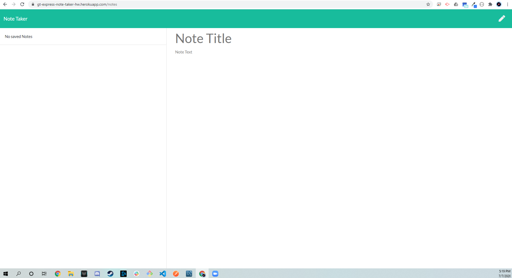

# Express Note Taker

[](https://opensource.org/licenses/MIT)

## Table of Contents
* [Description](#description)
* [Installation](#installation)
* [Usage](#usage)
* [Credits](#credits)
* [Contributing](#contributing)
* [License](#license)
* [URL](#url)
* [Questions](#questions)

## Description

This express based application allows the user to write notes, and save them to view at a later time. Additionally, the user can delete notes if they no longer need them.

## Installation

### To use in VScode
1. Navigate to where you'd like to store the note taker app on your local. 
2. Using the terminal, clone the github repository to the desired path.
3. Next run 'npm install express' to install any required dependencies on your local machine. 
4. Once installed, run 'node server-js' and navigate to generated URL on port 3000 and view in default browser.

### To use in Heroku
1. Navigate to the URL section of this README and open the heroku server.
2. The note taker app is available to use here without any additional modifications.

## Usage




## Credits
```
This was created by Brad Williams for the Georgia Tech Web Development Bootcamp.
```

## Contributing

Pull requests are welcome. If you would like to make any major changes to the code, please contact me first to open a discussion. My GitHub link and email are listed below.

## License

Copyright (c) [2020] [Brad Williams]

Permission is hereby granted, free of charge, to any person obtaining a copy of this software and associated documentation files (the "Software"), to deal in the Software without restriction, including without limitation the rights to use, copy, modify, merge, publish, distribute, sublicense, and/or sell copies of the Software, and to permit persons to whom the Software is furnished to do so, subject to the following conditions:

The above copyright notice and this permission notice shall be included in all copies or substantial portions of the Software.

THE SOFTWARE IS PROVIDED "AS IS", WITHOUT WARRANTY OF ANY KIND, EXPRESS OR IMPLIED, INCLUDING BUT NOT LIMITED TO THE WARRANTIES OF MERCHANTABILITY, FITNESS FOR A PARTICULAR PURPOSE AND NONINFRINGEMENT. IN NO EVENT SHALL THE AUTHORS OR COPYRIGHT HOLDERS BE LIABLE FOR ANY CLAIM, DAMAGES OR OTHER LIABILITY, WHETHER IN AN ACTION OF CONTRACT, TORT OR OTHERWISE, ARISING FROM, OUT OF OR IN CONNECTION WITH THE SOFTWARE OR THE USE OR OTHER DEALINGS IN THE SOFTWARE.

## URL

[Link to GitHub repository](https://github.com/bread-w/gt-express-note-taker-hw)

[Link to Heroku URL](https://gt-express-note-taker-hw.herokuapp.com/)

## Questions

If you have any questions, follow my GitHub profile here: https://github.com/bread-w.

You can also email me at jb.wms89@gmail.com.

